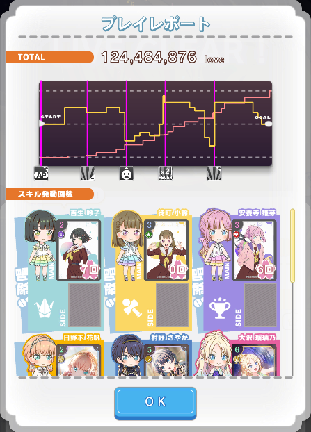
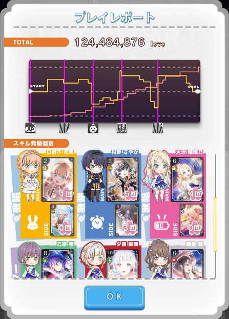
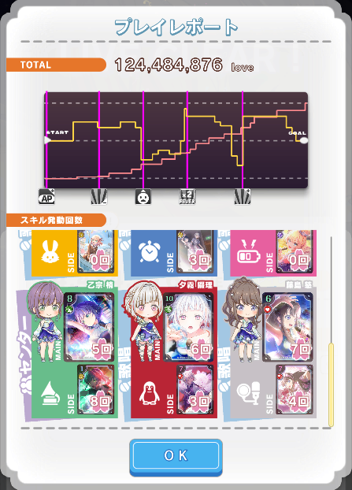

# Link! Like! LoveLive! PlayReport Concater

## What is This ?
スマートフォンアプリ『Link! Like! ラブライブ!』内のゲーム『スクールアイドルステージ』のプレイレポートを結合するツールです。

通常、プレイレポートは一部しか表示されません。
スクロールで全体を確認できますが、他のユーザーと共有する場合には全体が分かるように何枚かに分けてスクリーンショットを撮る必要があります。

このツールを使用することで、これらのスクリーンショットを一枚にまとめることができます。

また、スコアに影響するステータス画面やボーナス画面も一緒に結合することができます。

## 技術的な話

フロントエンドは Typescirpt + React、バックエンドは Python + Flask で記述されています。

フロントエンドは firebase hosting で静的サイトとしてホスティングしています。

フロントエンド側で [browser-image-compression](https://www.npmjs.com/package/browser-image-compression) を利用して画像を圧縮。
圧縮した画像をサーバーに送信し、処理された画像を受け取って表示します。

バックエンドはエンドポイントがひとつなので firebase functions で関数として実装しています。

受け取った画像は numpy の ndarray として受け取ります。

まず、スクリーンショットからプレイレポート部分だけを切り抜きます。
プレイレポートでない部分はプレイレポート部分と比べて暗くなっているので、適当な閾値で画像を二値化して明るい領域がどこからどこまでなのか、画像を上から見て top を、下から見て bottom を決定します。
画像を転置して同じ処理をすることで left と right も産出できます。
これによりプレイレポート部分の左上の座標 (top, left) と 右下の座標 (bottom, right) が決定されるので、これをもとに切り抜きます。

プレイレポートを 2 枚選び、グレースケールに変換して画像の差分を取ります。
これはプレイレポートの結合すべき部分を抜き出すためです。

圧縮時のノイズがあるためこれを独自のフィルタで取り除きます。
ノイズを取り除かなければ、のちの処理が上手く走らないためです。

元の画像から抜き出すべき部分の高さの上限 $h_u$ と高さの下限 $h_b$ を求めます。
画像の下端から差が小さい部分を辿って $h_b$ を求めます。
$h_b$ が求められたら今度は差が大きい部分を辿って $h_u$ を求めます。 

$h_u$ と $h_b$ が求められたらプレイレポートから必要な部分だけを切り出し、opencv の stiching 関数で連結します。

連結した部分の画像と、その他の部分を numpy の vstack 関数で連結し直して出力します。

別途、ステータス画面やボーナス画面があれば横に連結して出力します。

## やらなかったこと

画像を圧縮したかった。
しかし、サーバーでの処理時間は画像を圧縮したところで対して変わらないので、処理に時間がかかる圧縮は行わない方がユーザーの利益になると判断した。

画像をサイズを小さくできればユーザー側が負担する通信量を減らせるため圧縮を試みたが、フロントエンド側で画像を圧縮しようとすると一枚あたり 1500 ms かかってしまった。
サイズを縮小すればもっと高速化できるのだが、縮小すると特徴点がつぶれて sitiching 処理が上手くいかない場合が多かったので、縮小は断念。

必要な部分だけを crop して使おうと Jimp で crop 処理を行ってみたが、結局処理時間削減どころか 10% 増える結果になってしまった。

以上、 2 ケースを根拠に処理に時間がかかりすぎるため画像圧縮は断念することに。

ユーザー側がかける時間はリクエストを送信するまでの時間 + サーバーでの処理時間なので、リクエストを送信するまでに 4 秒近くかかるのは長すぎる。
サーバーでの処理時間は画像を圧縮したところで対して変わらないので、時間がかかる圧縮は行わない方がユーザーの利益になると判断した。